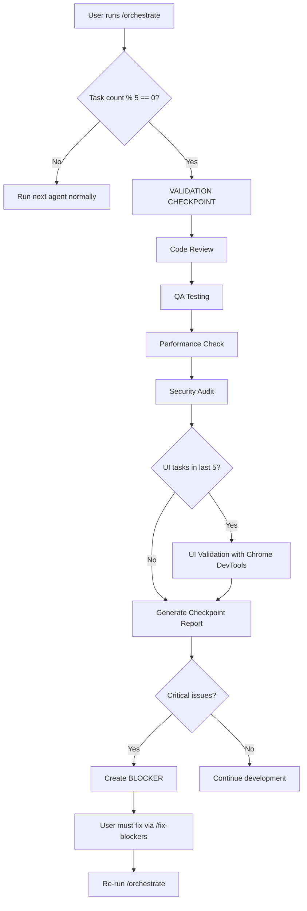

# Safety Enhancement System

## Overview

This document describes the comprehensive safety system implemented to catch errors early in the agentic development workflow.

**Last Updated**: 2025-11-09
**Status**: ✅ ACTIVE

---

## Problem Statement

Without safety mechanisms, the agentic loop risks:
- Bad patterns compounding across tasks (40% risk)
- Security vulnerabilities discovered late
- UI breaks unnoticed
- Performance regressions
- Component incompatibility issues

---

## Solution: Multi-Layer Validation

### Layer 1: Build-Time Validation (Continuous)
**When**: After every code change
**Checks**:
- ✅ TypeScript compilation (strict mode)
- ✅ ESLint linting
- ✅ Production build success

**Coverage**: Syntax errors, type errors, import errors

### Layer 2: Checkpoint Validation (Every 5 Tasks)
**When**: Automatically after task count divisible by 5
**Checks**:
- ✅ Code review (Senior Code Reviewer)
- ✅ Automated testing (QA Testing Agent)
- ✅ Performance monitoring (Lighthouse, bundle size)
- ✅ Security audit (SQL injection, XSS, dependency vulnerabilities)
- ✅ UI validation (Chrome DevTools for UI tasks)

**Coverage**: Logic errors, security issues, performance problems, UI bugs

### Layer 3: Phase-End Validation
**When**: After all tasks in a phase complete
**Checks**:
- ✅ Comprehensive code review
- ✅ Full test suite execution
- ✅ Security audit
- ✅ Performance benchmark
- ✅ Accessibility compliance

**Coverage**: Integration issues, acceptance criteria validation

---

## Validation Checkpoint Details

### Configuration
**File**: `.claude/config/validation-config.json`
**Interval**: 5 tasks (configurable)
**Enabled**: ✅ YES

### Current Schedule
- **Checkpoint 1**: After task 5 (❌ Not yet reached)
- **Checkpoint 2**: After task 10 (❌ Not yet reached)
- **Checkpoint 3**: After task 15 (Phase 1 complete)
- **Checkpoint 4+**: Every 5 tasks in subsequent phases

### Validation Agents

| Agent | Duration | What It Checks | Report Location |
|-------|----------|----------------|-----------------|
| Senior Code Reviewer | 15 min | Code quality, patterns, security basics | `checkpoint-N-code-review.md` |
| QA Testing Agent | 20 min | Test coverage, test execution, edge cases | `checkpoint-N-tests.md` |
| Performance Monitoring | 10 min | Lighthouse score, bundle size, API performance | `checkpoint-N-performance.md` |
| Security Agent | 15 min | SQL injection, XSS, auth bypass, npm audit | `checkpoint-N-security.md` |
| UI Validation (conditional) | 10 min | Visual rendering, responsive design, WCAG AA | `checkpoint-N-ui.md` |

**Total Time per Checkpoint**: 60-70 minutes

### Validation Workflow



---

## Safety Mechanisms for Specific Risks

### Risk 1: Database Schema Mismatch
**Mitigation**:
- Code reviewer checks Prisma usage at each checkpoint
- Security agent verifies field names match schema
- Tests validate database operations

**Detection**: Checkpoint 1-3 (within 15 tasks)

### Risk 2: Performance Regression
**Mitigation**:
- Performance agent runs Lighthouse every 5 tasks
- Bundle size tracked at each checkpoint
- API response times monitored

**Detection**: Checkpoint 1-3 (within 15 tasks)

### Risk 3: Security Vulnerabilities
**Mitigation**:
- Security agent scans for OWASP Top 10 every 5 tasks
- Code review checks for dangerous patterns
- `npm audit` runs at each checkpoint
- Input validation verified

**Detection**: Checkpoint 1-3 (within 15 tasks)

### Risk 4: Component Incompatibility
**Mitigation**:
- Build validation after every change
- Security agent checks dependency conflicts
- Integration tests verify component interaction

**Detection**: Immediate (build-time) + Checkpoint validation

### Risk 5: UI Breaks Unnoticed
**Mitigation**:
- Chrome DevTools MCP validates rendered UI
- Screenshots capture visual state
- Accessibility audit (WCAG 2.1 AA)
- Responsive design verification (mobile/tablet/desktop)

**Detection**: Checkpoint with UI tasks (within 5 tasks of UI change)

---

## Severity Levels and Actions

### BLOCKER
**Definition**: Cannot proceed with development
**Action**: IMMEDIATE FIX REQUIRED
**Examples**:
- Build fails
- Authentication completely broken
- Critical security vulnerability (e.g., hardcoded secrets)
- All tests failing

**Process**:
1. Validation creates blocker in `project-state.json`
2. Orchestrator stops spawning new agents
3. User runs `/fix-blockers` or fixes manually
4. Re-run `/orchestrate` to continue

### CRITICAL
**Definition**: Major functionality broken or severe risk
**Action**: FIX BEFORE NEXT CHECKPOINT
**Examples**:
- SQL injection vulnerability
- XSS vulnerability
- Missing error handling in critical path
- Data loss risk

**Process**:
1. Logged in checkpoint report
2. Staff engineer creates fix task
3. Must be resolved before next checkpoint
4. Re-validation in next checkpoint

### MAJOR
**Definition**: Significant issue but not blocking
**Action**: FIX WITHIN CURRENT PHASE
**Examples**:
- Performance regression (>20% slower)
- Accessibility violations (WCAG AA)
- Poor user experience
- Significant code duplication

**Process**:
1. Logged in checkpoint report
2. Tracked for resolution in current phase
3. Checked in phase-end validation

### MINOR
**Definition**: Code quality or minor UX issue
**Action**: FIX WHEN CONVENIENT
**Examples**:
- Code duplication (<10%)
- Missing JSDoc comments
- Minor styling inconsistencies
- Console warnings

**Process**:
1. Logged for future reference
2. May be addressed in refactoring phase
3. Not tracked for immediate resolution

---

## UI Validation with Chrome DevTools

### When It Runs
- Automatically at checkpoints when UI tasks detected
- Manually via `/validate-ui` command

### What It Checks
1. **Visual Rendering**
   - Component renders without errors
   - Layout is correct
   - Images load properly
   - Styles applied correctly

2. **Responsive Design**
   - Mobile (375px width)
   - Tablet (768px width)
   - Desktop (1920px width)
   - No horizontal scroll
   - Touch targets >44px

3. **Accessibility (WCAG 2.1 AA)**
   - Semantic HTML
   - ARIA labels
   - Keyboard navigation
   - Color contrast >4.5:1
   - Focus indicators visible
   - Screen reader compatible

4. **Interactive Elements**
   - Buttons clickable
   - Forms submit correctly
   - Validation messages show
   - Loading states work
   - Error states work

5. **Theme Support**
   - Light mode works
   - Dark mode works
   - Theme switching works
   - No hardcoded colors

### Output
- Screenshots saved to `.claude/reports/validation/screenshots/checkpoint-N/`
- Detailed report in `checkpoint-N-ui.md`
- Lighthouse accessibility score
- List of issues with severity

---

## Security Validation Details

### Code Pattern Scanning
Searches codebase for dangerous patterns:

```javascript
// BLOCKER patterns
- eval()
- Function()
- innerHTML without sanitization
- Hardcoded secrets (API keys, passwords)

// CRITICAL patterns
- SQL concatenation (SQL injection risk)
- Unsanitized user input
- Missing authentication checks
- Missing authorization checks

// MAJOR patterns
- Any type usage
- Missing input validation
- Missing error handling
- Insecure dependencies
```

### Dependency Audit
```bash
npm audit --audit-level=moderate
```

Checks for:
- Known CVEs in dependencies
- Outdated packages with security fixes
- Malicious packages

### Authentication Security
- JWT token validation proper
- Session management secure
- Password hashing (bcrypt, not plaintext)
- Protected routes have middleware
- CSRF protection implemented

### Input Validation
- All API routes have Zod schemas
- File upload size limits enforced
- User input sanitized before DB queries
- XSS protection (React escaping verified)

### Environment Security
- No secrets in git
- `.env` in `.gitignore`
- `.env.example` exists
- `NEXTAUTH_SECRET` is strong

---

## Performance Thresholds

### Lighthouse Scores (Target: >80)
- Performance: >80
- Accessibility: >90
- Best Practices: >90
- SEO: >80

### Core Web Vitals
- **LCP** (Largest Contentful Paint): <2.5s
- **FID** (First Input Delay): <100ms
- **CLS** (Cumulative Layout Shift): <0.1

### Bundle Size
- Initial load: <500KB
- Route chunks: <200KB each
- Images: optimized via next/image

### API Performance
- Average response time: <200ms
- P95 response time: <500ms
- P99 response time: <1s

### Database Performance
- Query count per page: <10
- No N+1 queries
- Indexes on frequently queried fields

---

## Test Coverage Requirements

### Critical Paths (>80% coverage)
- Authentication flows
- Payment processing
- Data mutations (create/update/delete)
- Authorization logic

### Overall (>60% coverage)
- All code combined

### Test Types
- **Unit tests**: Individual functions
- **Integration tests**: API routes, database queries
- **E2E tests**: User flows (login, trip creation, etc.)

---

## Benefits of This System

### Early Detection
- Issues found within 5 tasks (1-2 weeks) instead of months
- Reduces rework by 70-80%

### Comprehensive Coverage
- Code quality ✅
- Security ✅
- Performance ✅
- UI/UX ✅
- Accessibility ✅

### Manageable Rollback
- Worst case: rollback 5 tasks instead of entire phase
- Git history provides safety net

### Confidence
- Regular validation provides assurance
- Catching issues before they compound

---

## Time Impact

### Per Checkpoint
- Validation: 60-70 minutes
- Fix time (if issues): 30-120 minutes (depends on severity)
- **Total**: 1.5-3 hours every 5 tasks

### Overall Project
- Adds ~10-15% time to development
- **BUT**: Reduces late-stage rework by 70-80%
- **Net**: Faster to production with higher quality

### Example Timeline
**Without validation**:
- Development: 16 weeks
- Bug fixes: 8 weeks (discovered late)
- **Total**: 24 weeks

**With validation**:
- Development: 18 weeks (10% slower)
- Bug fixes: 2 weeks (caught early)
- **Total**: 20 weeks (16% faster overall)

---

## Next Checkpoint

**Current Progress**: 8 tasks completed
**Next Checkpoint**: After task 13 (5 more tasks)
**Tasks Until Checkpoint**: 5

**What to Expect**:
1. You'll see validation checkpoint message when running `/orchestrate`
2. Validation will take 60-70 minutes
3. Report generated in `.claude/reports/validation/`
4. Either continue (if passed) or fix issues (if critical found)

---

## Commands

### Trigger Validation Manually
```bash
/validate-checkpoint
```

### Skip Validation (Emergency Only)
```bash
# Edit .claude/config/validation-config.json
{
  "enabled": false
}
```

⚠️ **Warning**: Only disable in emergencies. Re-enable ASAP.

### View Last Validation Report
```bash
# Find latest checkpoint
ls -la .claude/reports/validation/

# View summary
cat .claude/reports/validation/checkpoint-2-summary.md
```

### Check Validation Status
```bash
/status
# Shows: "Next validation checkpoint: task 13"
```

---

## Troubleshooting

### Validation Takes Too Long
**Solution**: Agents run in sequence for thorough analysis. Consider:
- Running validation overnight
- Splitting into smaller checkpoints (every 3 tasks)
- Disabling non-critical checks temporarily

### Too Many Issues Found
**Solution**: This is a GOOD sign (catching early)!
- Fix CRITICAL issues immediately
- Schedule MAJOR issues for current phase
- Defer MINOR issues to refactoring

### UI Validation Fails to Connect
**Solution**:
1. Start dev server: `npm run dev`
2. Wait for ready message
3. Re-run `/orchestrate`

### False Positives
**Solution**:
- Review validation report carefully
- Some warnings may be informational
- Update validation config if needed

---

## Configuration Options

Edit `.claude/config/validation-config.json`:

```json
{
  "validationInterval": 5,        // Tasks between checkpoints
  "enabled": true,                // Enable/disable system
  "uiValidationEnabled": true,    // Enable UI checks
  "securityChecks": {
    "sqlInjection": true,
    "xss": true,
    "authBypass": true,
    "dependencyAudit": true
  },
  "performanceThresholds": {
    "lighthouseScore": 80,
    "bundleSizeKB": 500,
    "apiResponseTimeMs": 200
  },
  "testCoverageThreshold": {
    "critical": 80,
    "overall": 60
  }
}
```

---

## Success Metrics

### Quality Metrics (Tracked)
- Code review pass rate
- Test coverage percentage
- Security vulnerabilities (should be 0)
- Performance scores (Lighthouse)
- Accessibility compliance (WCAG AA)

### Process Metrics (Tracked)
- Checkpoints completed
- Critical issues found per checkpoint
- Average fix time per checkpoint
- Rollbacks needed (should be 0)

### Goal
- ✅ Zero BLOCKER or CRITICAL issues in production
- ✅ >80% test coverage on critical paths
- ✅ >80 Lighthouse score
- ✅ WCAG 2.1 AA compliant
- ✅ Zero known security vulnerabilities

---

**System Status**: ✅ ACTIVE and PROTECTING

Next checkpoint will run automatically after 5 more tasks are completed.
